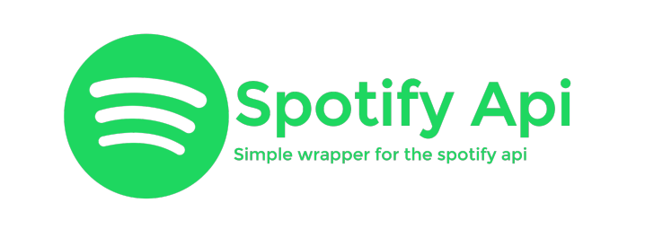

<!-- Improved compatibility of back to top link: See: https://github.com/othneildrew/Best-README-Template/pull/73 -->
<a name="readme-top"></a>
<!--
*** Thanks for checking out the Best-README-Template. If you have a suggestion
*** that would make this better, please fork the repo and create a pull request
*** or simply open an issue with the tag "enhancement".
*** Don't forget to give the project a star!
*** Thanks again! Now go create something AMAZING! :D
-->


<!-- PROJECT SHIELDS -->
<!--
*** I'm using markdown "reference style" links for readability.
*** Reference links are enclosed in brackets [ ] instead of parentheses ( ).
*** See the bottom of this document for the declaration of the reference variables
*** for contributors-url, forks-url, etc. This is an optional, concise syntax you may use.
*** https://www.markdownguide.org/basic-syntax/#reference-style-links
-->
[![Contributors][contributors-shield]][contributors-url]
[![Forks][forks-shield]][forks-url]
[![Stargazers][stars-shield]][stars-url]
[![Issues][issues-shield]][issues-url]
[![MIT License][license-shield]][license-url]
[![LinkedIn][linkedin-shield]][linkedin-url]


<!-- PROJECT LOGO -->
<br />
<div align="center">
  <a href="https://github.com/gregoryfiel/spotify-data-analysis">
    
  </a>

<h3 align="center">Spotify Data Automation: Artist Info Retrieval</h3>

  <p align="center">
    This repository showcases a Spotify Data Automation System employing Python. It seamlessly retrieves and organizes artist information, utilizing CSV files and an SQLite database. Explore efficient data access and analysis with this automation script.
    <br />
    <a href="https://github.com/gregoryfiel/ranking-names-ibge/issues">Report Bug</a>
    ·
    <a href="https://github.com/gregoryfiel/ranking-names-ibge/issues">Request Feature</a>
  </p>
</div>


<!-- TABLE OF CONTENTS -->
<details>
  <summary>Table of Contents</summary>
  <ol>
    <li>
      <a href="#about-the-project">About The Project</a>
      <ul>
        <li><a href="#built-with">Built With</a></li>
      </ul>
    </li>
    <li>
      <a href="#getting-started">Getting Started</a>
      <ul>
        <li><a href="#prerequisites">Prerequisites</a></li>
        <li><a href="#installation">Installation</a></li>
      </ul>
    </li>
    <li><a href="#usage">Usage</a></li>
    <li><a href="#contributing">Contributing</a></li>
    <li><a href="#license">License</a></li>
    <li><a href="#contact">Contact</a></li>
    <li><a href="#acknowledgments">Acknowledgments</a></li>
  </ol>
</details>


<!-- ABOUT THE PROJECT -->
## About The Project

### Built With

* [![Python][Python]][Python-url]
* [![Pandas][Pandas]][Pandas-url]
* [![SQLite][SQLite]][SQLite-url]
* [![Git][Git]][Git-url]

<p align="right">(<a href="#readme-top">back to top</a>)</p>


<!-- GETTING STARTED -->
## Getting Started

Introducing the Spotify Data Automation System—a Python-based tool designed for effortless data interaction with the Spotify API. This system simplifies the retrieval and organization of artist information and top tracks.

Key Features:

* Data Retrieval: The ConsumeAPI class effortlessly fetches artist details and top tracks from the Spotify API.

* Data Storage: Using an SQLite database, the ConnectToSQLite class ensures structured data storage for easy retrieval.

* Export Functionality: The DataExporter class streamlines data export to both SQLite and CSV formats.

* Data Access: The DataProvider class simplifies querying the SQLite database for recent artist or top tracks data.

### Prerequisites
* Python: You can download and install Python from [Python's official website](https://www.python.org/).

* Requirements.txt
```sh
pip install -r requirements.txt
```

### Installation

1. Clone the repo
   ```sh
   git clone https://github.com/gregoryfiel/ranking-names-ibge.git
   ```
2. Storage your Spotify API credentials in the .env
    ```sh
    CLIENT_ID=your_client_id
    CLIENT_SECRET=your_client_secret
    ```
3. Install dependencies

<p align="right">(<a href="#readme-top">back to top</a>)</p>


<!-- USAGE EXAMPLES -->
## Usage

Run the script with command-line arguments to export data or retrieve artist/top tracks information.

### 1. Export Data
When you run the follow command, the system checks for existing data in the database for the current day.
* If there is no data for the current day, it fetches artist information and top tracks from the Spotify API, adds it to the SQLite database, and creates a CSV file for easy access and analysis.
* If the data for the current day already exists, the system ensures no duplicate entries are added to maintain data integrity.
```bash
python main.py --export_data
```

### 2. Get Artist Data
To retrieve artist data, use the follow command.
* The system queries the SQLite database for the most recent data related to the specified artist.
* It returns a dictionary containing key details such as artist ID, query date, name, followers, and artist popularity.
* The result is printed to the terminal for quick and easy visualization.
```bash
python main.py --get_artist_data <artist_name_or_id>
```

### 3. Get Top Tracks Data
For obtaining top tracks data, execute the follow command.
* The system queries the SQLite database for the most recent top tracks data related to the specified artist.
* It returns a dictionary containing details such as artist ID, query date, song name, popularity, release date, album name, and total tracks.
* The result is printed to the terminal for convenient viewing.
```bash
python main.py --get_top_tracks_data <artist_name_or_id>
```

<p align="right">(<a href="#readme-top">back to top</a>)</p>

<!-- CONTRIBUTING -->
## Contributing

Contributions are what make the open source community such an amazing place to learn, inspire, and create. Any contributions you make are **greatly appreciated**.

If you have a suggestion that would make this better, please fork the repo and create a pull request. You can also simply open an issue with the tag "enhancement".
Don't forget to give the project a star! Thanks again!

1. Fork the Project
2. Create your Feature Branch (`git checkout -b feature/AmazingFeature`)
3. Commit your Changes (`git commit -m 'Add some AmazingFeature'`)
4. Push to the Branch (`git push origin feature/AmazingFeature`)
5. Open a Pull Request

<p align="right">(<a href="#readme-top">back to top</a>)</p>


<!-- LICENSE -->
## License

Distributed under the MIT License. See `LICENSE.txt` for more information.

<p align="right">(<a href="#readme-top">back to top</a>)</p>


<!-- CONTACT -->
## Contact

Gregory - [@twitter_handle](https://twitter.com/gregoryfiel)

Project Link: [https://github.com/gregoryfiel/spotify-data-analysis](https://github.com/gregoryfiel/spotify-data-analysis)

<p align="right">(<a href="#readme-top">back to top</a>)</p>


<!-- ACKNOWLEDGMENTS -->
## Acknowledgments

* Thanks to Ilegra for providing this opportunity to learn by doing.
* Special mention to the Clean Code principles for code maintainability.

<p align="right">(<a href="#readme-top">back to top</a>)</p>


<!-- MARKDOWN LINKS & IMAGES -->
<!-- https://www.markdownguide.org/basic-syntax/#reference-style-links -->
[contributors-shield]: https://img.shields.io/github/contributors/gregoryfiel/ranking-names-ibge.svg?style=for-the-badge
[contributors-url]: https://github.com/gregoryfiel/ranking-names-ibge/graphs/contributors
[forks-shield]: https://img.shields.io/github/forks/gregoryfiel/ranking-names-ibge.svg?style=for-the-badge
[forks-url]: https://github.com/gregoryfiel/ranking-names-ibge/network/members
[stars-shield]: https://img.shields.io/github/stars/gregoryfiel/ranking-names-ibge.svg?style=for-the-badge
[stars-url]: https://github.com/gregoryfiel/ranking-names-ibge/stargazers
[issues-shield]: https://img.shields.io/github/issues/gregoryfiel/ranking-names-ibge.svg?style=for-the-badge
[issues-url]: https://github.com/gregoryfiel/ranking-names-ibge/issues
[license-shield]: https://img.shields.io/github/license/gregoryfiel/ranking-names-ibge.svg?style=for-the-badge
[license-url]: https://github.com/gregoryfiel/ranking-names-ibge/blob/main/LICENSE
[linkedin-shield]: https://img.shields.io/badge/-LinkedIn-black.svg?style=for-the-badge&logo=linkedin&colorB=555
[linkedin-url]: https://www.linkedin.com/in/gregory-fiel
[product-screenshot]: images/capture.png
[Python]:https://img.shields.io/badge/python-3670A0?style=for-the-badge&logo=python&logoColor=ffdd54
[Python-url]:https://www.python.org/
[Redis]: https://img.shields.io/badge/redis-%23DD0031.svg?style=for-the-badge&logo=redis&logoColor=white
[Redis-url]: https://redis.io/
[Git]: https://img.shields.io/badge/git-%23F05033.svg?style=for-the-badge&logo=git&logoColor=white
[Git-url]: https://git-scm.com/
[Pandas]: https://img.shields.io/badge/git-%23F05033.svg?style=for-the-badge&logo=git&logoColor=white
[Pandas-url]: https://pandas.pydata.org/docs/index.html
[SQLite]: https://img.shields.io/badge/sqlite-%2307405e.svg?style=for-the-badge&logo=sqlite&logoColor=white
[SQLite-url]: https://www.sqlite.org/index.html
